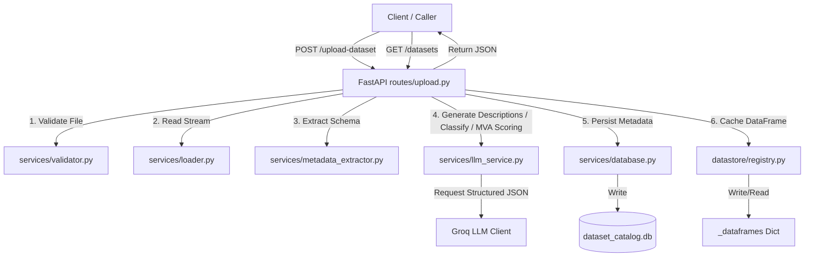
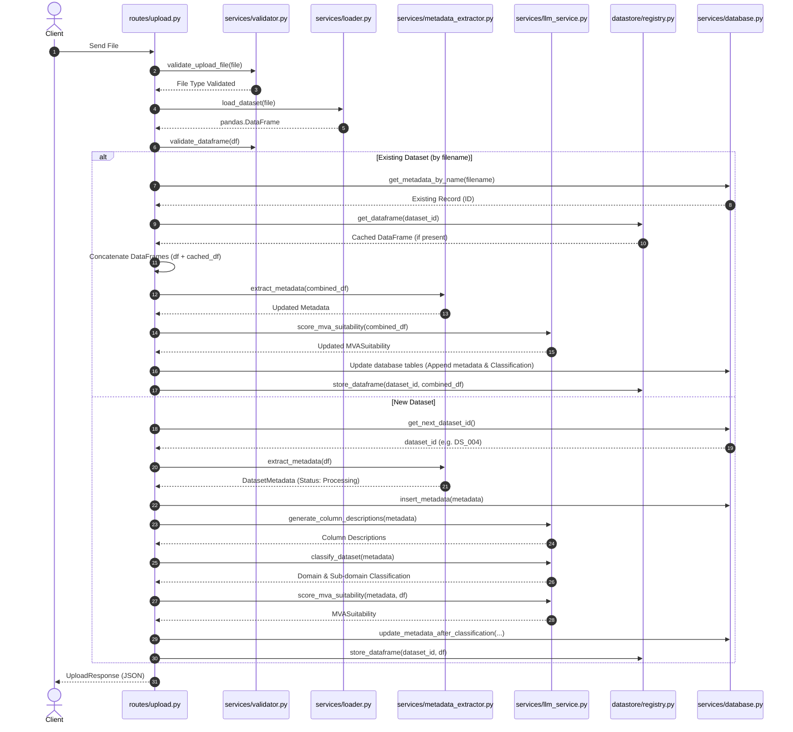

# Schema Intelligence Layer — Technical Project Analysis

This document provides a comprehensive technical analysis of the **Schema Intelligence Layer** project. The project is designed as an agentic data-profiling and intelligence service that ingests tabular datasets (CSV and Excel format), extracts technical schemas, generates natural language metadata descriptions using a Groq-hosted Large Language Model (LLM), and evaluates the dataset's suitability for Multivariate Analysis (MVA).

---

## 1. System Architecture & Component Design

The application is structured as a modular, stateless REST API built on **FastAPI**, with state persisted in an SQLite database and raw datasets cached in memory.

### Directory Structure & Code Layout

*   [app/main.py](file:///C:/Users/ANAS%20MUMTAZ/Desktop/MVA/Schema_Intelligence_layer/app/main.py): FastAPI server setup, lifespan database initialization, and middleware registration.
*   [app/config.py](file:///C:/Users/ANAS%20MUMTAZ/Desktop/MVA/Schema_Intelligence_layer/app/config.py): Configuration class using `pydantic-settings` to load `.env` variables.
*   [app/models/schemas.py](file:///C:/Users/ANAS%20MUMTAZ/Desktop/MVA/Schema_Intelligence_layer/app/models/schemas.py): Pydantic schemas defining internal types and API request/response structures.
*   [app/routes/upload.py](file:///C:/Users/ANAS%20MUMTAZ/Desktop/MVA/Schema_Intelligence_layer/app/routes/upload.py): API endpoints implementing file upload, appending, metadata retrieval, and cached DataFrame access.
*   [app/services/](file:///C:/Users/ANAS%20MUMTAZ/Desktop/MVA/Schema_Intelligence_layer/app/services/): Core business logic layer:
    *   [validator.py](file:///C:/Users/ANAS%20MUMTAZ/Desktop/MVA/Schema_Intelligence_layer/app/services/validator.py): Ingestion size, format, and DataFrame structural validation.
    *   [loader.py](file:///C:/Users/ANAS%20MUMTAZ/Desktop/MVA/Schema_Intelligence_layer/app/services/loader.py): Asynchronous tabular parsing into Pandas DataFrames.
    *   [metadata_extractor.py](file:///C:/Users/ANAS%20MUMTAZ/Desktop/MVA/Schema_Intelligence_layer/app/services/metadata_extractor.py): Extraction of rows, columns, data types, and sample data.
    *   [llm_service.py](file:///C:/Users/ANAS%20MUMTAZ/Desktop/MVA/Schema_Intelligence_layer/app/services/llm_service.py): Client communications with the Groq API for classification, column descriptions, and MVA scoring.
    *   [database.py](file:///C:/Users/ANAS%20MUMTAZ/Desktop/MVA/Schema_Intelligence_layer/app/services/database.py): SQLite CRUD operations and automated migrations.
*   [app/prompts/llm_service_prompt.py](file:///C:/Users/ANAS%20MUMTAZ/Desktop/MVA/Schema_Intelligence_layer/app/prompts/llm_service_prompt.py): Structured system and user templates enforcing JSON outputs.
*   [app/datastore/registry.py](file:///C:/Users/ANAS%20MUMTAZ/Desktop/MVA/Schema_Intelligence_layer/app/datastore/registry.py): Global in-memory dictionary caching Pandas DataFrames in RAM.
*   [test_local.py](file:///C:/Users/ANAS%20MUMTAZ/Desktop/MVA/Schema_Intelligence_layer/test_local.py): Command-line test utility running files through the entire pipeline offline.

### Component Relationship Diagram



---

## 2. Ingestion & Analysis Workflow

When a file (CSV or Excel) is uploaded to the `/upload-dataset` endpoint, it goes through the following sequence:



---

## 3. Database Schema

The metadata is persisted in `dataset_catalog.db` under the table `dataset_metadata`. The schema includes direct column definitions and JSON-serialized fields.

### `dataset_metadata` Table Structure

| Column Name | SQLite Type | Default Value | Description |
| :--- | :--- | :--- | :--- |
| **`dataset_id`** (PK) | `TEXT` | *None* | Unique primary key (e.g., `DS_001`, `DS_002`) |
| **`dataset_name`** | `TEXT` | *None* | Filename of the uploaded file |
| **`file_type`** | `TEXT` | *None* | Ingested file type (e.g. `CSV`, `Excel (XLSX)`) |
| **`upload_timestamp`** | `TEXT` | *None* | ISO 8601 UTC timestamp of creation/update |
| **`business_domain`** | `TEXT` | `'Pending'` | Categorized domain (Finance, Sales, Marketing, etc.) |
| **`sub_domain`** | `TEXT` | `'General'` | Specific taxonomy sub-category |
| **`dataset_summary`** | `TEXT` | `''` | 1-2 sentence overview generated by LLM |
| **`row_count`** | `INTEGER` | *None* | Total number of rows in the table |
| **`column_count`** | `INTEGER` | *None* | Total number of columns in the table |
| **`column_names`** | `TEXT` | `'[]'` | JSON list of column header strings |
| **`column_data_types`** | `TEXT` | `'[]'` | JSON list of Pandas data type strings |
| **`column_descriptions`**| `TEXT` | `'{}'` | JSON object mapping column name to its description |
| **`sample_data`** | `TEXT` | `'[]'` | JSON list of dictionaries containing first N sample rows |
| **`processing_status`** | `TEXT` | `'Processing'` | Status flag (`Processing`, `Completed`, `Partial`) |
| **`mva_suitability`** | `TEXT` | `NULL` | JSON object containing suitability scores and reasoning |
| **`score`** | `INTEGER` | `NULL` | Integer suitability score extracted from MVA results |

> [!NOTE]
> Database operations are handled using native `sqlite3` queries inside [app/services/database.py](file:///C:/Users/ANAS%20MUMTAZ/Desktop/MVA/Schema_Intelligence_layer/app/services/database.py). The database initialization script (`init_db`) performs on-the-fly table migrations, automatically adding columns like `sub_domain`, `column_names`, `column_data_types`, `mva_suitability`, and `score` if missing from prior runs.

---

## 4. Current Database State

We queried the database (`dataset_catalog.db`) and found **4 indexed datasets**:

| ID | Dataset Name | Business Domain | Sub-Domain | Row Count | Column Count | MVA Score | Status |
| :--- | :--- | :--- | :--- | :--- | :--- | :--- | :--- |
| `DS_001` | `banking_variance_data.csv` | Finance | Banking Performance | 1,200 | 91 | 0 | Completed |
| `DS_002` | `insurance_variance_data_native.csv` | Other | General | 1,000 | 141 | 0 | Completed |
| `DS_003` | `mx_variance_sample_v2_updated.xlsx` | Finance | Transaction Settlement | 10,000 | 29 | 70 | Completed |
| `DS_004` | `neutral_payments_variance_trxnid_1000.xlsx`| Pending | General | 1,000 | 25 | *None* | Processing |

> [!IMPORTANT]
> `DS_004` is currently marked with a status of `Processing` and has a `None` score. This indicates that its classification or MVA scoring phase was interrupted, or it is currently undergoing extraction in a background thread or a separate command.

---

## 5. Core Feature Deep Dive

### A. Column Descriptions Generation
Using the column names, Pandas data types, and a curated list of up to 3 non-empty values per column, the service builds a concise context block. This block is passed to Groq (`llama-3.1-8b-instant` by default) with a prompt that restricts description length to one sentence (max ~20 words) and requires fallback handling for ambiguous headers.

### B. Business Domain Classification
Categorizes datasets into one of nine parent domains (Finance, Sales, Marketing, HR, Operations, Supply Chain, Customer Support, Healthcare, Other). Crucially, the LLM must choose a sub-domain from a predefined taxonomy dictionary listed in [app/services/llm_service.py](file:///C:/Users/ANAS%20MUMTAZ/Desktop/MVA/Schema_Intelligence_layer/app/services/llm_service.py#L35-L111). The prompt instructs the LLM to output classification confidence and technical reasoning.

### C. Multivariate Analysis (MVA) Suitability Assessment
Evaluates whether a dataset can undergo advanced statistical calculations (such as Principal Component Analysis, Factor Analysis, Cluster Analysis, or Multiple Regression).
*   **Methodology**: It extracts the **first 20 rows** and the **last 20 rows** of the dataset, converts them to CSV representations, and passes them to the LLM (truncating to the first 20 columns if the dataset is wide).
*   **Evaluation parameters**:
    *   `structural_consistency_score`: Checks for schema drift, misalignment, or sudden formatting changes between the start and end of the file.
    *   `numerical_variable_density_score`: Scores the ratio of continuous numerical columns (crucial for covariance/variance operations).
    *   `missing_data_risk`: Identifies null density hazards.

### D. In-Memory DataFrame Cache
When a dataset is processed (either through the API or via `test_local.py`), the parsed Pandas DataFrame is registered in a global `_dataframes` dictionary in [app/datastore/registry.py](file:///C:/Users/ANAS%20MUMTAZ/Desktop/MVA/Schema_Intelligence_layer/app/datastore/registry.py).
*   **Purpose**: Allows downstream analysis scripts or agents to query raw records via `/datasets/{dataset_id}/dataframe` without reloading files from disk.
*   **Eviction**: A `remove_dataframe` function exists to free memory, though it is currently not automatically triggered based on LRU or size thresholds.

---

## 6. Codebase Strengths & Areas for Improvement

### Key Strengths
1.  **Robust Error Fallbacks**: If the Groq API call fails or outputs invalid JSON, the services automatically fall back to baseline descriptions and classifications (e.g., categorizing as `Other/General` and using column names as placeholder descriptions) rather than breaking the upload pipeline.
2.  **Schema Auto-Migrations**: The SQLite database driver dynamically alters tables to add missing fields, preventing schema-out-of-sync crashes when deploying updates.
3.  **Memory-Efficient Profiling**: The system never sends full dataset rows to the LLM. It isolates structural schema metadata and limited row chunks (first/last 20 rows), making it highly token-efficient and secure.

### Areas for Improvement (Technical Debt)

#### 1. Inconsistent SQLite Connection Handling
*   **Observation**: In [app/services/database.py](file:///C:/Users/ANAS%20MUMTAZ/Desktop/MVA/Schema_Intelligence_layer/app/services/database.py), connections are opened and closed manually inside every function using a helper (`_get_connection()`).
*   **Risk**: There is no pooling or thread-safe management. While SQLite is suitable for low-concurrency catalog tasks, simultaneous writes (e.g., parallel file uploads) can raise `sqlite3.OperationalError: database is locked`.
*   **Recommendation**: Implement SQLAlchemy or SQLModel with context managers to wrap transactions safely.

#### 2. Typo in Database Append Operation
*   **Observation**: In [app/routes/upload.py](file:///C:/Users/ANAS%20MUMTAZ/Desktop/MVA/Schema_Intelligence_layer/app/routes/upload.py#L90-L95), when a dataset is appended, the server attempts to calculate the MVA suitability score:
    ```python
    try:
        mva_suitability = score_mva_suitability(new_metadata, combined_df)
        new_metadata.mva_suitability = mva_suitability
    except Exception as e:
        ...
    ```
    Then, it calls `update_metadata_after_classification` to persist it. However, the signature for `update_metadata_after_classification` in [app/services/database.py](file:///C:/Users/ANAS%20MUMTAZ/Desktop/MVA/Schema_Intelligence_layer/app/services/database.py#L192) annotates `mva_suitability` with `Optional[DatasetMetadata]` instead of `Optional[MVASuitability]`.
*   **Effect**: Python runs it fine because of dynamic typing, but IDE linters will flag this as a type mismatch. The signature should be updated to `Optional[Union[MVASuitability, dict, Any]]` or similar.

#### 3. In-Memory Registry Lifespan
*   **Observation**: DataFrames are stored in a global dict in memory. If the Uvicorn server restarts (or reload triggers), the cache is wiped clean. If a client subsequently queries `/datasets/{dataset_id}/dataframe`, they receive a `404` error stating the DataFrame was evicted.
*   **Recommendation**: Implement a simple serialization mechanism to dump the DataFrame cache to a temporary parquet file or SQLite blob if memory eviction occurs, and reload it lazily when requested.

#### 4. No Automated Test Suites
*   **Observation**: The codebase lacks unit or integration tests (e.g. `pytest`). Local validation is done manually using `test_local.py`.
*   **Recommendation**: Write tests for the schema validators, dataset loaders, and fallback LLM services using mocked HTTP calls for the Groq client.
