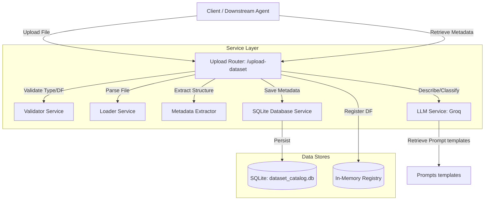

# Project Analysis: Schema Intelligence Layer (Dataset Identification Agent)

This report provides a comprehensive analysis of the **Schema Intelligence Layer** (also named **Dataset Identification Agent**). This FastAPI-based agent is designed to ingest tabular datasets (CSV and Excel formats), extract basic structural metadata, generate descriptive column-level metadata using an LLM (via Groq), classify the dataset's business domain, and store these metadata records in a centralized SQLite database, while keeping the full datasets in memory for consumption by downstream agents.

---

## 1. System Architecture

The project is structured as a standard Python/FastAPI service following a layered pattern:
- **Presentation Layer (APIs)**: API routers defining endpoints for uploads and metadata retrieval.
- **Service Layer (Logic)**: Business logic components for validation, file parsing, metadata extraction, LLM interactions, and database operations.
- **Data Access & Storage**: Persistent catalog storage in SQLite (`dataset_catalog.db`) and transient in-memory dataframe storage (`registry.py`).
- **Configuration**: Pydantic-settings configuration using an `.env` file.



---

## 2. Key Components Breakdown

### 2.1 Configuration (`app/config.py`)
The system settings are defined in [config.py](file:///c:/Users/ANAS%20MUMTAZ/Desktop/MVA/Schema_Intelligence_layer/app/config.py) using `pydantic-settings`. Key variables are:
- `GROQ_API_KEY`: API key for accessing Groq's LLM API.
- `GROQ_MODEL`: Groq model deployed (default: `llama-3.1-8b-instant`).
- `DATABASE_PATH`: SQLite database file path (default: `./dataset_catalog.db`).
- `MAX_UPLOAD_SIZE_MB`: Max upload size limit (default: 100MB).
- `SAMPLE_ROWS`: Row count for sample data stored in metadata (default: 5).

### 2.2 Data Models (`app/models/schemas.py`)
The metadata schemas are declared in [schemas.py](file:///c:/Users/ANAS%20MUMTAZ/Desktop/MVA/Schema_Intelligence_layer/app/models/schemas.py):
- `ColumnInfo`: Represents metadata for a specific column (name, data type, description, sample values).
- `LLMClassification`: Structure returned by LLM classification (domain, sub-domain, summary, confidence, reason).
- `DatasetMetadata`: Represents the full metadata structure stored in the DB (ID, file name, timestamp, domain, summary, row count, column count, list of column names, data types, dict of column descriptions, and sample row dictionaries).
- `UploadResponse`: The API response returned after successful dataset processing, containing metadata plus `dataframe_records` (the entire dataset converted to list of dicts).

### 2.3 Routes (`app/routes/upload.py`)
The controller endpoints in [upload.py](file:///c:/Users/ANAS%20MUMTAZ/Desktop/MVA/Schema_Intelligence_layer/app/routes/upload.py) handle:
- `POST /upload-dataset`: Orchestrates the processing pipeline (validation -> loading -> extraction -> metadata database save -> LLM descriptions -> LLM classification -> metadata db update -> registry cache).
- `GET /datasets`: Lists all cataloged datasets with high-level summary fields.
- `GET /datasets/{dataset_id}`: Retrieves the detailed metadata record for a dataset.
- `GET /datasets/{dataset_id}/dataframe`: Fetches the in-memory dataframe cache for downstream agent consumption (supports row limit).

### 2.4 Services (`app/services/`)
- **[validator.py](file:///c:/Users/ANAS%20MUMTAZ/Desktop/MVA/Schema_Intelligence_layer/app/services/validator.py)**: Ensures the file extension is supported (`.csv`, `.xlsx`, `.xls`) and checks that parsed dataframes are non-empty and well-formed.
- **[loader.py](file:///c:/Users/ANAS%20MUMTAZ/Desktop/MVA/Schema_Intelligence_layer/app/services/loader.py)**: Uses Pandas to read binary uploads directly from memory bytes into a DataFrame (using `openpyxl` for Excel files).
- **[metadata_extractor.py](file:///c:/Users/ANAS%20MUMTAZ/Desktop/MVA/Schema_Intelligence_layer/app/services/metadata_extractor.py)**: Extracts properties like row/column counts, lists names & dtypes, and generates the `sample_data` block (safe-casting types and handling NaN values).
- **[llm_service.py](file:///c:/Users/ANAS%20MUMTAZ/Desktop/MVA/Schema_Intelligence_layer/app/services/llm_service.py)**: Interacts with Groq to generate column descriptions and classify datasets. Has fallback modes in case the Groq API fails or JSON formatting is invalid.
- **[database.py](file:///c:/Users/ANAS%20MUMTAZ/Desktop/MVA/Schema_Intelligence_layer/app/services/database.py)**: Manages SQLite CRUD operations. On startup, creates the schema if missing and applies an automatic schema migration to add the `sub_domain` column.

### 2.5 In-Memory DataFrame Registry (`app/datastore/registry.py`)
- Provides a thread-safe global Python dictionary (`_dataframes`) caching loaded Pandas DataFrames.
- Downstream agents can directly read from this cache via `/datasets/{dataset_id}/dataframe` or by calling Python helpers, avoiding the overhead of re-reading raw files.

---

## 3. Data Processing & LLM Ingestion Flow

The detailed step-by-step processing execution during dataset upload follows:

```
[UploadFile] ──> [Validator] ──> [Loader] ──> [Metadata Extractor] ──> [SQLite (Insert Initial)]
                                                                               │
[SQLite (Update Status/Fields)] <── [LLM Classification] <── [LLM Descriptions] <┘
```

### Groq LLM Prompting Logic
The prompts in [llm_service_prompt.py](file:///c:/Users/ANAS%20MUMTAZ/Desktop/MVA/Schema_Intelligence_layer/app/prompts/llm_service_prompt.py) use structured templates:
1. **Column Descriptions**: The LLM receives the dataset name, size, column names, column data types, and first 5 sample rows. It is requested to output a JSON object mapping columns to 1-sentence explanations.
2. **Business Domain Classification**: The LLM receives the same metadata plus the newly generated column descriptions. It chooses from predefined taxonomies (Finance, Sales, Marketing, Human Resources, Operations, Supply Chain, Customer Support, Healthcare, or Other) and matching sub-domains (e.g., E-commerce, Payments, Recruitment), and outputs a summary, confidence score, and justification.

---

## 4. Observations & Potential Improvements

Based on the analysis, here are structural observations and potential improvements:

1. **In-Memory Storage Lifetime & Reliability**:
   - The in-memory registry (`app/datastore/registry.py`) resides solely in the application's RAM. If the FastAPI application server restarts or scales horizontally, previously uploaded datasets stored in the registry will be lost, although their metadata remains in SQLite.
   - *Recommendation*: Consider adding a persistent storage layer for the raw datasets (e.g., saving uploaded files to disk in an `uploads/` folder or cloud storage) so they can be re-loaded into memory on-demand if the registry cache misses.

2. **Concurrency and Thread Safety**:
   - The in-memory dictionary `_dataframes` in `registry.py` is modified concurrently without a threading lock. In a highly concurrent server using multiple ASGI worker threads, race conditions could occur.
   - *Recommendation*: Protect dictionary operations in `registry.py` with standard thread-locks (`threading.Lock`).

3. **LLM Error Handling & Fallback Robustness**:
   - The fallback for LLM column descriptions generates standard placeholding descriptions (e.g., `Column 'name' of type object`).
   - If the first LLM request for column descriptions fails, the second LLM request (classification) is still executed with fallback descriptions, which is standard, but could be enhanced with retry logic or local classification heuristics.

4. **Testing Coverage**:
   - The current workspace includes a local test script [test_local.py](file:///c:/Users/ANAS%20MUMTAZ/Desktop/MVA/Schema_Intelligence_layer/test_local.py) which exercises the pipeline standalone. However, there are no mock unit tests for routes or services, which makes CI/CD verification harder.
   - *Recommendation*: Introduce a test suite using `pytest` and `httpx.AsyncClient` to mock the Groq LLM API and test API endpoints in isolation.
